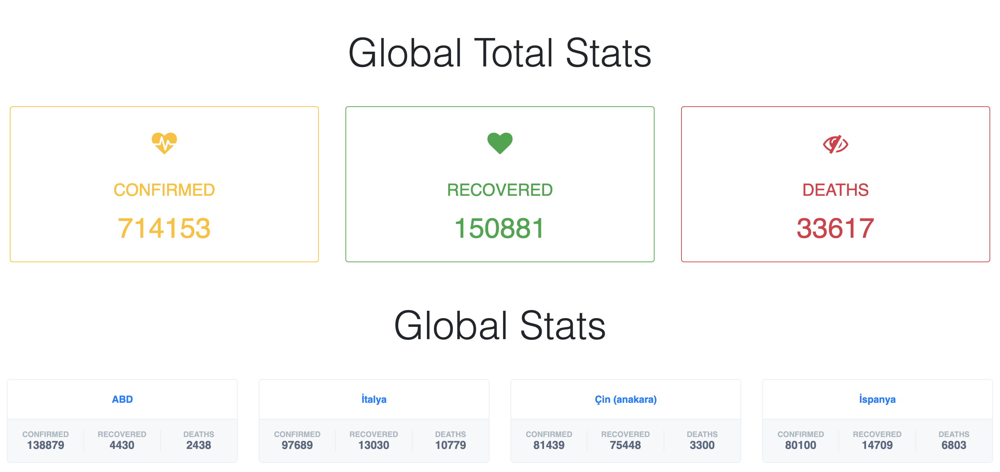

## About Covid-19 Dashboard

COVID-19 Dashboard; monitor local and global coronavirus cases with confirmed, recovered and deaths rate.

## Installation
- Clone the repo `git clone git@github.com:rizaergun/covid-19-dashboard.git`
- Run `composer install` to pull in all the dependencies
- Run `php artisan server` to start the inbuilt PHP server
- Visit http://127.0.0.1:8000

## Todo

## License

The Laravel framework is open-sourced software licensed under the [MIT license](https://opensource.org/licenses/MIT).
